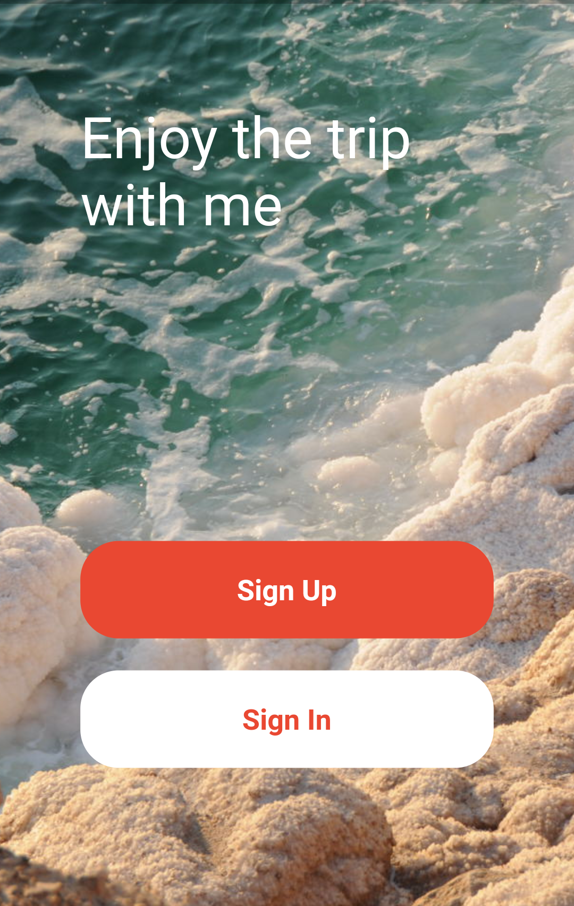
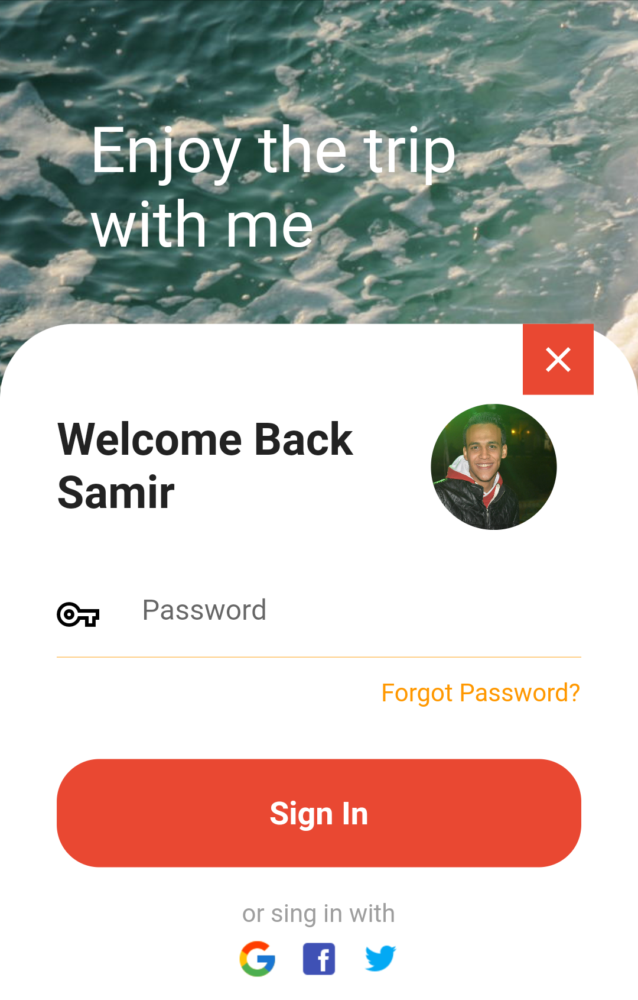
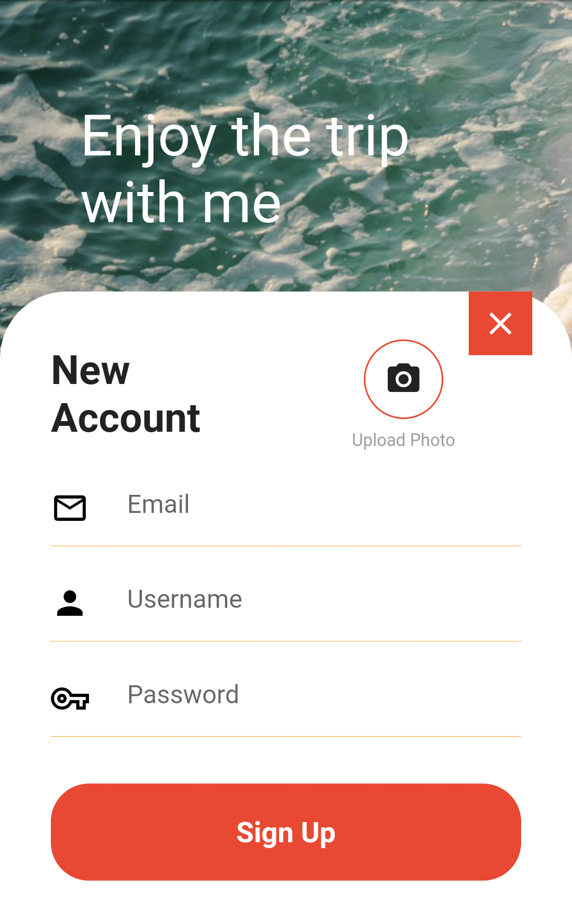

# Trip Login UI
Simple page for login / register with some animations created by Flutter framework.

 

## Table of contents
* [General info](#general-info)
* [Technologies](#technologies)
* [Launch](#launch)
* [Setup](#setup)
* [Example of use](#example-of-use)

 
 

## General info
You can choose whether you need to sign-in / sign-up with simple animations, attractive colors and beautiful background.

 

## Technologies
Project is created with:
* Dart as programming language
* Flutter as framework of Dart

 

## Launch
1. connect you real device / emulator (Android) / simulator (IOS)
1. open lib folder
2. run [main.dart](lib/main.dart)

 

## Setup
1. visit [Flutter](https://flutter.dev/docs/get-started/install "Flutter setup page")
2. choose your operating system
3. follow the instructions to install Flutter successfully

 

## Example of use
 

   

<!-- width=274 cause Github width is 824, and we have 3 images so 824/3 = 274.7 -->